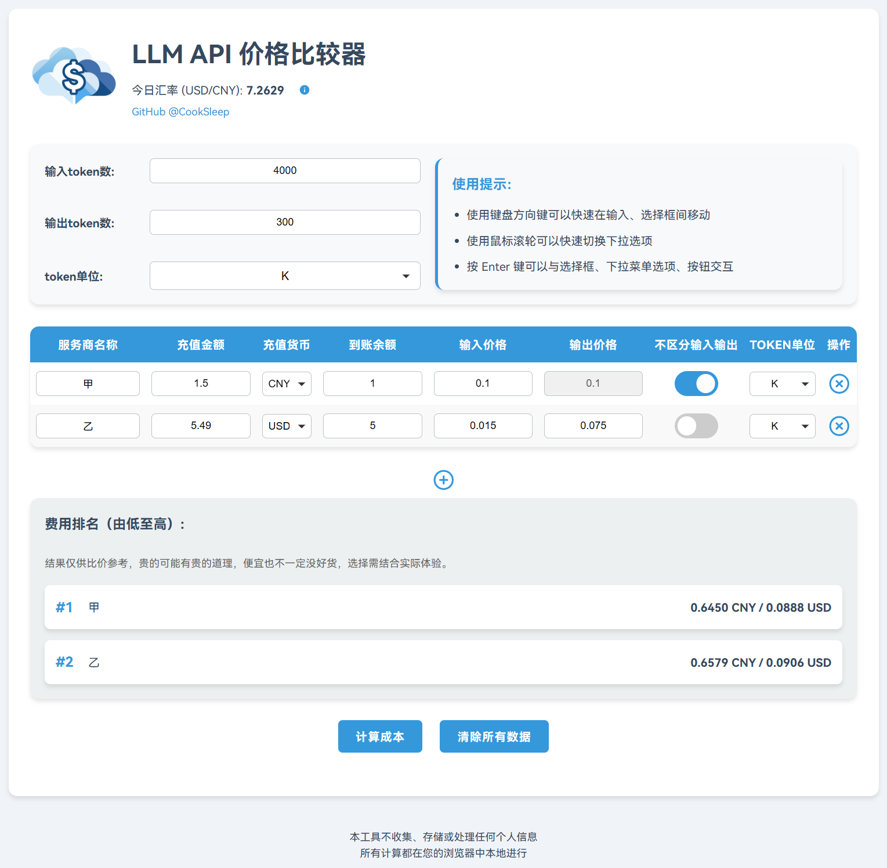

<h1 align="center">LLM API Price Comparator Web</h1>

<p align="center">
  
</p>

LLM API Price Comparator Web 是一个在线工具，帮助用户便捷地比较不同LLM API服务商在指定输入输出下调用同一种模型的价格。

它会自动获取美元/人民币汇率，允许用户输入服务商的余额、调用定价信息，并计算、比较相对于输入输出Token的成本。

该项目是原Windows桌面应用的网页版本，代码主要由Claude 3.5 Sonnet和GPT-4o编写，我提供了非常多的样式、功能设计提议和反馈。



## 功能特性

- 自动获取美元/人民币汇率，方便比较国内外服务商。
- 用户可输入服务商名称、充值金额、充值货币、到账余额、调用价格等详细信息。
- 支持不同服务商的费用排名显示，按成本从低到高排序。
- 提供直观的Web界面，方便添加、删除服务商信息。
- 生成人民币、美元费用比较结果。
- 响应式设计，支持桌面和移动设备。

## 如何使用

1. 访问 [LLM API Price Comparator Web](https://cooksleep.github.io/LLM_API_Price_Comparator_Web/)。
2. 在页面上输入Token数(输入和输出)。
3. 填写每个服务商的相关信息。
4. 点击"计算成本"按钮以获取不同服务商的成本比较。
5. 查看费用排名，选择合适的服务商。


## 自行部署指南

本项目使用 GitHub Actions 自动更新汇率数据，并通过 GitHub Pages 部署静态网站。以下是如何 Fork 本仓库并配置 GitHub Actions 和 GitHub Pages 的步骤。

### 1. Fork 仓库

1. 访问 [LLM API Price Comparator Web](https://github.com/CookSleep/LLM_API_Price_Comparator_Web) 仓库页面。
2. 点击页面右上角的 "Fork" 按钮，将该仓库 Fork 到你的 GitHub 账户中。

### 2. 配置 GitHub Actions

1. 在你的 GitHub 仓库中创建 `.github/workflows` 目录
2. 在该目录中创建 `update_exchange_rate.yml` 文件，内容如下：

```yaml
name: Update Exchange Rate

on:
  schedule:
    - cron: '30 1 * * *' # 每天UTC时间01:30，相当于北京时间09:30
  workflow_dispatch: # 手动触发

permissions:
  contents: write

jobs:
  update-exchange-rate:
    runs-on: ubuntu-latest

    steps:
      - name: Checkout repository
        uses: actions/checkout@v2

      - name: Install dependencies
        run: |
          python -m pip install requests

      - name: Fetch exchange rate from Alpha Vantage
        env:
          ALPHA_VANTAGE_API_KEY: ${{ secrets.ALPHA_VANTAGE_API_KEY }}
        run: |
          python update_exchange_rate.py

      - name: Commit and push changes
        env:
          GITHUB_TOKEN: ${{ secrets.GITHUB_TOKEN }}
        run: |
          git config --local user.email "action@github.com"
          git config --local user.name "GitHub Action"
          git add exchange_rate.json
          git commit -m "Update exchange rate"
          git push origin HEAD:main
```

### 3. 创建 Python 脚本

在仓库根目录创建 `update_exchange_rate.py` 文件，内容如下：

```python
import os
import requests
import json

def fetch_exchange_rate(api_key):
    url = f'https://www.alphavantage.co/query?function=CURRENCY_EXCHANGE_RATE&from_currency=USD&to_currency=CNY&apikey={api_key}'
    response = requests.get(url)
    data = response.json()
    if 'Realtime Currency Exchange Rate' in data:
        return data['Realtime Currency Exchange Rate']
    else:
        raise Exception("Error fetching exchange rate")

def main():
    api_key = os.getenv('ALPHA_VANTAGE_API_KEY')
    if not api_key:
        raise Exception("No API key found in environment variables")
    
    exchange_rate = fetch_exchange_rate(api_key)
    with open('exchange_rate.json', 'w') as f:
        json.dump(exchange_rate, f, indent=4)

if __name__ == '__main__':
    main()
```

### 4. 配置 Secrets

为了确保你的 API 密钥和 GitHub Token 安全地存储和使用，你需要在 GitHub 仓库设置中配置 Secrets。

1. 在 [Alpha Vantage](https://www.alphavantage.co/) 获取 Alpha Vantage API 密钥。
2. 导航到你的 GitHub 仓库。
3. 点击 "Settings"。
4. 在左侧菜单中选择 "Secrets and variables" > "Actions"。
5. 点击 "New repository secret"。
6. **Name**: `ALPHA_VANTAGE_API_KEY`
7. **Value**: 你的 Alpha Vantage API 密钥。
8. 点击 "Add secret" 保存。

### 5. 配置仓库设置

确保配置仓库的 GitHub Actions 设置，以允许使用外部 Actions 并设置适当的权限：

1. 在仓库的 "Settings" 页面，选择 "Actions" > "General"。
2. 在 "Actions permissions" 部分：
   - 选择 "Allow all actions and reusable workflows"。
   - 勾选 "Allow actions created by GitHub"。
3. 在 "Workflow permissions" 部分：
   - 选择 "Read and write permissions"。
   - 勾选 "Allow GitHub Actions to create and approve pull requests"。
4. 点击 "Save" 保存更改。

### 6. 创建 GitHub Pages

1. 导航到你的 GitHub 仓库。
2. 点击 "Settings"。
3. 在左侧菜单中选择 "Pages"。
4. 在 "Build and deployment" 部分：
   - **Source**: 选择 `Deploy from a branch`。
   - **Branch**: 选择 `main` 分支，并确保目录是 `/root`。
5. 点击 "Save"。

完成这些步骤后，GitHub Pages 将从你的 `main` 分支部署，你可以通过 `https://<your-username>.github.io/LLM_API_Price_Comparator_Web` 访问你的静态网站。

### 手动触发汇率更新（初次部署后如果没到汇率更新时间时可能需要）

1. 导航到你的 GitHub 仓库页面。
2. 点击 "Actions" 选项卡。
3. 在左侧找到 "Update Exchange Rate" 工作流。
4. 点击 "Run workflow" 按钮，然后点击 "Run workflow" 确认。

完成以上步骤后，GitHub Actions 将自动或根据需要手动更新汇率数据，并将更新后的数据提交到你的仓库中，同时通过 GitHub Pages 部署静态网站。

## 贡献

欢迎对项目进行贡献！如果您有任何建议或想要添加新功能，请随时创建一个Issue或Pull Request。

## 许可证

## 许可证

本项目采用 [GNU General Public License v3.0](https://www.gnu.org/licenses/gpl-3.0.html) 许可证，详情请见 [LICENSE](LICENSE) 文件。
